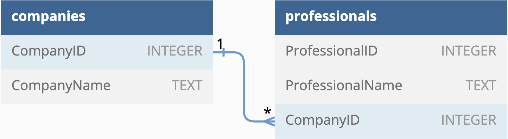

<details>
  <summary>14.4</summary>

  There are inner join, left join, right join and full join. In set theory, these correspond to intersection, set differences and union, respectively. Inner join is useful when you want to only get rows that have matching values in both tables. The other joins (outer joins) are useful when you get want to retain rows whether they have matching values or not.
</details>

<details>
  <summary>14.5</summary>

  Denormalization is a technique to duplicate rows in a database. It's useful when you do many queries, where you have to repeatedly calculate joins. A disadvantage is that it takes up more space than the normalized version.
</details>

<details>
  <summary>14.6</summary>

  The diagram (generated by [https://dbdiagram.io/d](https://dbdiagram.io/d)) will look like the following.
  
</details>

<details>
  <summary>14.7</summary>

  I would make a single table `grades` that has as columns student ID, student name, and the grade for each subject. An SQLite query then would look something like the following.

  ```SQL
  SELECT TOP(10) PERCENT
    SUM(english, math, science) as grade
  FROM grades
  ORDER BY grade;
  ```
</details>
